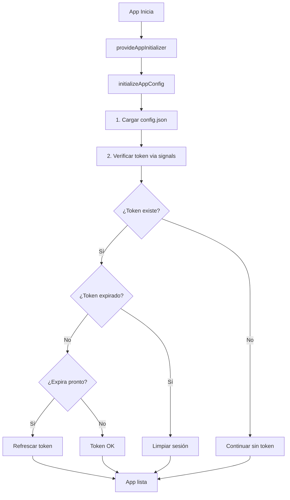

# 🔐 Sistema de Autenticación - Ezekl Budget App

## 📋 Descripción General

Sistema completo de autenticación basado en tokens JWE con flujo de autenticación de 2 pasos:

1. **Solicitud de PIN**: Usuario ingresa su código y recibe PIN de 5 dígitos por **Email**
2. **Verificación de PIN**: Usuario ingresa el PIN y obtiene token JWE encriptado (válido 24 horas)

**Tecnologías:**
- ✅ Angular 20+ con Signals
- ✅ Backend FastAPI con JWE (JSON Web Encryption)
- ✅ Redis para blacklist de tokens revocados
- ✅ Dual template (Mobile/Desktop) con control flow moderno

---

## 🔄 Flujo Completo de Autenticación

### 1. Login (2 Pasos)

#### **Paso 1: Solicitar PIN**

**Endpoint**: `POST /api/v1/auth/request-token`

```typescript
// En el componente
requestPin() {
  this.authService.requestLoginToken(this.codeLogin).subscribe({
    next: (response) => {
      // response.success: boolean
      // response.tokenGenerated: boolean
      // response.message: string
      // PIN enviado por Email
      this.step = 'verify';
    }
  });
}
```

**Request:**
```json
{
  "codeLogin": "S"
}
```

**Response:**
```json
{
  "success": true,
  "message": "Token generado y enviado a SMS y Email",
  "tokenGenerated": true
}
```

---

#### **Paso 2: Verificar PIN e Iniciar Sesión**

**Endpoint**: `POST /api/v1/auth/login`

```typescript
// En el componente
verifyPin() {
  this.authService.loginWithToken(this.codeLogin, this.token).subscribe({
    next: (response) => {
      // Token JWE guardado automáticamente vía signals + effects
      // Usuario redirigido a returnUrl o /home
      this.router.navigate([this.returnUrl]);
    }
  });
}
```

**Request:**
```json
{
  "codeLogin": "S",
  "token": "12345"
}
```

**Response:**
```json
{
  "success": true,
  "message": "Login exitoso",
  "user": {
    "idLogin": 123,
    "codeLogin": "S",
    "nameLogin": "Juan Pérez",
    "phoneLogin": "83681485",
    "emailLogin": "juan@ejemplo.com",
    "idCompany": 1
  },
  "accessToken": "eyJhbGciOiJkaXIiLCJlbmMiOiJBMjU2R0NNIn0...",
  "expiresAt": "2026-01-15T14:30:00Z"
}
```

---

### 2. Logout

El logout se puede ejecutar desde:
- **Mobile**: Menú lateral (sidebar)
- **Desktop**: Dropdown de usuario en header

**Endpoint**: `POST /api/v1/auth/logout`

```typescript
logout() {
  this.authService.logout().subscribe({
    next: () => {
      // Token agregado a blacklist en Redis
      // Tokens de 5 dígitos eliminados de BD
      // Usuario redirigido a /login
    },
    error: () => {
      // Limpieza local aunque falle el backend
      this.authService.clearSession();
    }
  });
}
```

**Headers requeridos:**
```
Authorization: Bearer {token}
```

**Query parameters (opcionales):**
- `microsoft_logout=true`: También cerrar sesión en Microsoft

**Response:**
```json
{
  "success": true,
  "message": "Logout exitoso. Sesión cerrada correctamente.",
  "microsoft_logout_url": "https://login.microsoftonline.com/...",
  "redirect_required": false
}
```

**Proceso del logout:**
1. ✅ Valida token JWE del header
2. ✅ Agrega token a blacklist en Redis (TTL 24h)
3. ✅ Limpia localStorage y redirige a login

---

### 3. Verify Token (Privado)

Obtener información del usuario autenticado y verificar token.

**Endpoint**: `GET /api/v1/auth/verify-token.json`

```typescript
// Requiere autenticación
this.authService.verifyToken().subscribe({
  next: (response) => {
    console.log('Usuario:', response.user);
    console.log('Expira:', response.expiresAt);
  }
});
```

**Headers requeridos:**
```
Authorization: Bearer {token}
```

**Response:**
```json
{
  "user": {
    "idLogin": 123,
    "codeLogin": "S",
    "nameLogin": "Juan Pérez",
    "phoneLogin": "83681485",
    "emailLogin": "juan@ejemplo.com"
  },
  "expiresAt": "2026-01-15T14:30:00Z",
  "issuedAt": "2026-01-14T14:30:00Z"
}
```

---

### 4. Refresh Token (Automático)

#### **En Inicialización de la App**

El sistema valida y refresca automáticamente el token al cargar la aplicación:

```typescript
// app.config.ts - initializeAppConfig()
async function initializeAppConfig() {
  // 1. Cargar configuración remota
  const config = await fetch(configUrl).then(r => r.json());
  
  // 2. Validar y refrescar token si es necesario
  const authService = inject(AuthService);
  
  if (authService.isAuthenticated()) {
    // Token expirado - limpiar sesión
    if (authService.isTokenExpired()) {
      authService.clearSession();
      return;
    }
    
    // Token próximo a expirar (< 5 min) - refrescar
    if (authService.isTokenExpiringSoon()) {
      await authService.refreshToken().toPromise();
    }
  }
}
```

#### **En Interceptor HTTP (Error 401)**

```typescript
// auth.interceptor.functional.ts
intercept(request, next) {
  return next.handle(request).pipe(
    catchError((error) => {
      if (error.status === 401) {
        // Intentar refrescar token automáticamente
        return this.authService.refreshToken().pipe(
          switchMap((response) => {
            // Reintentar request con nuevo token
            return next.handle(addToken(request, response.accessToken));
          }),
          catchError(() => {
            // Si falla refresh, cerrar sesión
            this.authService.clearSession();
            return throwError(error);
          })
        );
      }
      return throwError(error);
    })
  );
}
```

**Endpoint**: `POST /api/v1/auth/refresh-token`

**Headers requeridos:**
```
Authorization: Bearer {token}
```

**Response:**
```json
{
  "success": true,
  "message": "Token renovado exitosamente",
  "accessToken": "eyJhbGciOiJkaXIiLCJlbmMiOiJBMjU2R0NNIn0...",
  "expiresAt": "2026-01-15T14:30:00Z"
}
```

---

## 🛡️ Seguridad

### Token JWE (Encrypted)

- **Algoritmo**: A256GCM (AES-GCM 256-bit)
- **Tipo**: JWE (JSON Web Encryption) - **NO es JWT**
- **Contenido**: Datos del usuario encriptados
- **Expiración**: 24 horas
- **Storage**: localStorage (navegador)

### Blacklist de Tokens Revocados

- **Almacenamiento**: Redis
- **TTL**: 24 horas (igual que expiración del token)
- **Validación**: En cada request mediante interceptor

### Validaciones de Seguridad

1. ✅ Token encriptado (no firmado)
2. ✅ Validación de expiración en cada request
3. ✅ Blacklist de tokens revocados
4. ✅ Limpieza automática de tokens expirados
5. ✅ Refresh automático antes de expirar

---

## 🔧 AuthService - Signals (Angular 20+)

### Signals Reactivos

```typescript
// Estado del usuario (Signal)
readonly currentUser: Signal<UserData | null>

// Token de autenticación (Signal)
readonly token: Signal<string | null>

// Fecha de expiración (Signal)
readonly tokenExpiresAt: Signal<string | null>

// Computed Signals
readonly isAuthenticated: Signal<boolean>
readonly isTokenExpired: Signal<boolean>
readonly isTokenExpiringSoon: Signal<boolean>
```

### Uso en Componentes

```typescript
// Inyectar servicio
private authService = inject(AuthService);

// En el componente
ngOnInit() {
  // Leer valor actual del signal
  const user = this.authService.currentUser();
  console.log('Usuario:', user?.nameLogin);
  
  // Verificar autenticación
  if (this.authService.isAuthenticated()) {
    console.log('Usuario autenticado');
  }
}
```

### Uso en Templates (Control Flow)

```html
<!-- Verificar autenticación -->
@if (authService.isAuthenticated()) {
  <div class="user-info">
    <h2>Bienvenido {{ authService.currentUser()?.nameLogin }}</h2>
    <p>Email: {{ authService.currentUser()?.emailLogin }}</p>
  </div>
}

<!-- Mostrar loader si está expirando -->
@if (authService.isTokenExpiringSoon()) {
  <div class="alert alert-warning">
    Tu sesión expirará pronto. Guardando cambios...
  </div>
}

<!-- Mostrar error si expiró -->
@if (authService.isTokenExpired()) {
  <div class="alert alert-danger">
    Tu sesión ha expirado. Por favor inicia sesión nuevamente.
  </div>
}
```

### Métodos del AuthService

#### Autenticación

```typescript
// Paso 1: Solicitar PIN
requestLoginToken(codeLogin: string): Observable<RequestTokenResponse>

// Paso 2: Login con PIN
loginWithToken(codeLogin: string, token: string): Observable<LoginResponse>

// Logout
logout(microsoftLogout?: boolean): Observable<LogoutResponse>

// Limpiar sesión local sin llamar al backend
clearSession(): void
```

#### Gestión de Token

```typescript
// Verificar token y obtener datos del usuario
verifyToken(): Observable<VerifyTokenResponse>

// Refrescar token (extender expiración)
refreshToken(): Observable<RefreshTokenResponse>

// Obtener token actual
getToken(): string | null

// Obtener headers con autenticación
getAuthHeaders(): HttpHeaders
```

#### Información del Usuario

```typescript
// Obtener usuario actual
getCurrentUser(): UserData | null
```

---

## 📱 Componentes UI

### LoginComponent

**Archivo**: [login.ts](./login.ts)

**Estados:**
- `step: 'request'` - Solicitar PIN
- `step: 'verify'` - Verificar PIN

**Características:**
- ✅ Dual template (Mobile/Desktop) con `@if`
- ✅ Timer de reenvío (60 segundos)
- ✅ Validación de PIN (5 dígitos numéricos)
- ✅ Manejo de errores con mensajes descriptivos
- ✅ Redirección automática post-login
- ✅ Responsive con ResponsiveComponent

**Propiedades:**
```typescript
codeLogin: string;        // Código de usuario
token: string;            // PIN de 5 dígitos
step: 'request' | 'verify'; // Estado del flujo
loading: boolean;         // Estado de carga
errorMessage: string;     // Mensaje de error
successMessage: string;   // Mensaje de éxito
resendTimer: number;      // Timer de reenvío (60s)
returnUrl: string;        // URL de redirección post-login
```

### SidebarComponent (Mobile)

**Logout:**
```html
<ion-button (click)="logout()">
  <ion-icon name="log-out-outline"></ion-icon>
  Cerrar Sesión
</ion-button>
```

### HeaderComponent (Desktop)

**Logout:**
```html
<a href="javascript:;" class="dropdown-item" (click)="logout()">
  Cerrar Sesión
</a>
```

---

## 🚀 Flujo de Inicialización



---

## 🔍 Guards y Protección de Rutas

### AuthGuard

```typescript
// app.routes.ts
import { authGuard } from './shared/guards/auth.guard';

export const routes: Routes = [
  {
    path: 'home',
    component: HomePage,
    canActivate: [authGuard] // Functional guard (Angular 20+)
  }
];
```

**Comportamiento:**
- ✅ Verifica `authService.isAuthenticated()` (signal)
- ✅ Redirige a `/login` si no autenticado
- ✅ Preserva `returnUrl` en queryParams

**Implementación moderna:**
```typescript
// auth.guard.ts
export const authGuard: CanActivateFn = (route, state) => {
  const authService = inject(AuthService);
  const router = inject(Router);
  
  if (authService.isAuthenticated()) {
    return true;
  }
  
  // Redirigir a login con returnUrl
  return router.createUrlTree(['/login'], {
    queryParams: { returnUrl: state.url }
  });
};
```

---

## 📝 LocalStorage

### Datos Almacenados

```typescript
{
  "token": "eyJhbGciOiJkaXIiLCJlbmMiOiJBMjU2R0NNIn0...",
  "userData": "{\"idLogin\":123,\"codeLogin\":\"S\",...}",
  "tokenExpiresAt": "2026-01-15T14:30:00Z"
}
```

### Sincronización Automática con Signals

Los signals del AuthService se sincronizan automáticamente con localStorage mediante `effect()`:

```typescript
// En AuthService constructor
effect(() => {
  const user = this.currentUser();
  if (user) {
    localStorage.setItem('userData', JSON.stringify(user));
  } else {
    localStorage.removeItem('userData');
  }
});

effect(() => {
  const tokenValue = this.token();
  if (tokenValue) {
    localStorage.setItem('token', tokenValue);
  } else {
    localStorage.removeItem('token');
  }
});
```

### Limpieza

- En logout manual
- En logout automático (token expirado)
- En error 401 después de fallar refresh

---

## 🧪 Testing

### Endpoints a Probar

#### 1. Request Token

```bash
curl -X POST 'http://localhost:8000/api/v1/auth/request-token' \
  -H 'Content-Type: application/json' \
  -d '{"codeLogin": "S"}'
```

#### 2. Login

```bash
curl -X POST 'http://localhost:8000/api/v1/auth/login' \
  -H 'Content-Type: application/json' \
  -d '{"codeLogin": "S", "token": "12345"}'
```

#### 3. Verify Token

```bash
curl -X GET 'http://localhost:8000/api/v1/auth/verify-token.json' \
  -H 'Authorization: Bearer eyJhbGciOiJkaXIi...'
```

#### 4. Refresh Token

```bash
curl -X POST 'http://localhost:8000/api/v1/auth/refresh-token' \
  -H 'Authorization: Bearer eyJhbGciOiJkaXIi...'
```

#### 5. Logout

```bash
curl -X POST 'http://localhost:8000/api/v1/auth/logout' \
  -H 'Authorization: Bearer eyJhbGciOiJkaXIi...'
```

---

## 🐛 Debugging

### Logs de Consola

```typescript
// En AuthService, activar DEBUG_AUTH = true
private readonly DEBUG_AUTH = true;

// Logs disponibles:
📤 Solicitando token para: S
📥 Respuesta solicitud token: {...}
📤 Iniciando sesión con token: {...}
📥 Respuesta login: {...}
✅ Sesión iniciada correctamente
👤 Usuario: Juan Pérez
⏰ Expira: 2026-01-15T14:30:00Z
🚪 Cerrando sesión...
✅ Sesión cerrada en servidor
🔍 Verificando token...
✅ Token válido, usuario: Juan Pérez
🔄 Refrescando token...
✅ Token refrescado exitosamente
⏰ Nueva expiración: 2026-01-15T14:30:00Z
🧹 Limpiando autenticación...
✅ Autenticación limpiada
```

---

## 📚 Estructura de Archivos

```
app/pages/login/
├── login.ts              # Componente principal
├── login.html            # Template dual (mobile/desktop)
├── login.scss            # Estilos
└── README.md             # Esta documentación

app/service/
└── auth.service.ts       # Servicio modernizado con signals

app/shared/
├── models/
│   └── auth.models.ts    # Interfaces TypeScript
├── guards/
│   └── auth.guard.ts     # Functional guard
└── interceptors/
    └── auth.interceptor.functional.ts  # Interceptor funcional
```

---

## ✅ Checklist de Implementación

- [x] Login de 2 pasos (PIN por Email)
- [x] Token JWE encriptado
- [x] Logout con blacklist en Redis
- [x] Refresh automático en inicialización
- [x] Refresh automático en error 401
- [x] Validación de expiración de token
- [x] AuthGuard funcional para proteger rutas
- [x] Dual template (Mobile/Desktop) con control flow
- [x] Signals reactivos (Angular 20+)
- [x] Effects para sincronización automática
- [x] Computed signals para validaciones
- [x] Manejo de errores completo
- [x] Limpieza automática de sesión

---

## 🔮 Mejoras Futuras

1. **Biometría**: Integrar Touch ID / Face ID en móvil
2. **Remember Me**: Opción de mantener sesión más tiempo
3. **Multi-dispositivo**: Gestión de sesiones activas
4. **2FA Opcional**: Segundo factor de autenticación
5. **Push Notifications**: Alertas de login sospechoso
6. **Token Rotation**: Rotación automática de claves JWE
7. **Rate Limiting**: Límite de intentos de login
8. **OAuth Providers**: Google, GitHub, etc.

---

## 🆕 Cambios en Angular 20+

### Signals vs BehaviorSubject

**Antes (RxJS):**
```typescript
private userSubject = new BehaviorSubject<UserData | null>(null);
public user$ = this.userSubject.asObservable();

// Actualizar
this.userSubject.next(userData);

// Leer en template
{{ (authService.user$ | async)?.nameLogin }}
```

**Ahora (Signals):**
```typescript
readonly currentUser = signal<UserData | null>(null);

// Actualizar
this.currentUser.set(userData);

// Leer en template (sin pipe async!)
{{ authService.currentUser()?.nameLogin }}
```

### Control Flow vs *ngIf

**Antes:**
```html
<div *ngIf="isAuthenticated">Contenido</div>
<div *ngIf="isAuthenticated; else notAuth">Contenido</div>
```

**Ahora:**
```html
@if (isAuthenticated()) {
  <div>Contenido</div>
} @else {
  <div>No autenticado</div>
}
```

### Functional Guards e Interceptors

**Antes (Class-based):**
```typescript
@Injectable()
export class AuthGuard implements CanActivate {
  canActivate() { /* ... */ }
}
```

**Ahora (Functional):**
```typescript
export const authGuard: CanActivateFn = (route, state) => {
  const authService = inject(AuthService);
  // ...
};
```

---

**Última actualización**: 15 de enero de 2026  
**Versión**: 2.0.0 (Angular 20+ con Signals)  
**Autor**: Ezequiel Baltodano Cubillo

