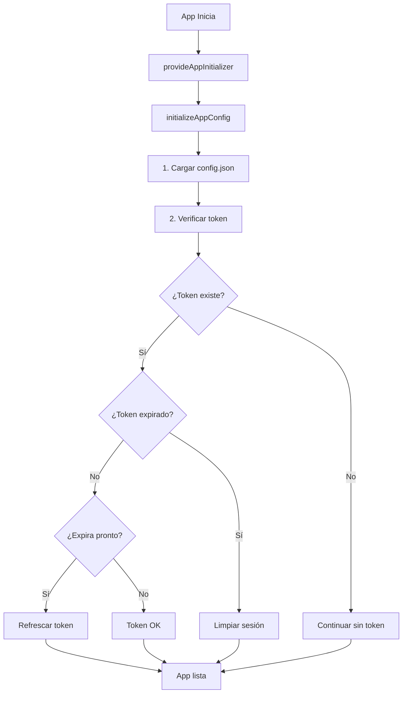

# 🔐 Sistema de Autenticación - Voice Bot App

## 📋 Descripción General

Sistema completo de autenticación basado en tokens JWE con autenticación de dos pasos:
1. **Solicitud de PIN**: Usuario ingresa su código y recibe PIN de 5 dígitos por SMS/Email
2. **Verificación de PIN**: Usuario ingresa el PIN y obtiene token JWE encriptado

---

## 🔄 Flujo Completo de Autenticación

### 1. Login (2 Pasos)

#### **Paso 1: Solicitar PIN**
```typescript
// Endpoint: POST /{merchant_id}/v1/auth/login-token
requestPin() {
  this.authService.requestLoginToken(this.codeLogin).subscribe({
    next: (response) => {
      // response.idLogin - ID del usuario
      // PIN enviado por SMS y Email
      this.step = 'verify';
    }
  });
}
```

**Request:**
```json
{
  "codeLogin": "S"
}
```

**Response:**
```json
{
  "success": true,
  "message": "Token generado y enviado a SMS y Email",
  "idLogin": 123
}
```

#### **Paso 2: Verificar PIN e Iniciar Sesión**
```typescript
// Endpoint: POST /{merchant_id}/v1/auth/login
verifyPin() {
  this.authService.loginWithToken(this.idLogin, this.token).subscribe({
    next: (response) => {
      // Token JWE guardado automáticamente en localStorage
      // Usuario redirigido a returnUrl o /home
      this.router.navigate([this.returnUrl]);
    }
  });
}
```

**Request:**
```json
{
  "idLogin": 123,
  "token": "12345"
}
```

**Response:**
```json
{
  "success": true,
  "message": "Login exitoso",
  "user": {
    "idMerchant": 1,
    "idLogin": 123,
    "codeLogin": "S",
    "nameLogin": "Juan Pérez",
    "phoneLogin": "83681485",
    "emailLogin": "juan@ejemplo.com"
  },
  "token": "eyJhbGciOiJkaXIiLCJlbmMiOiJBMjU2R0NNIn0...",
  "expiresAt": "2026-01-07T14:30:00Z"
}
```

---

### 2. Logout

El logout se puede ejecutar desde:
- **Mobile**: Menú lateral (sidebar)
- **Desktop**: Dropdown de usuario en header

#### **Implementación**
```typescript
// Endpoint: POST /{merchant_id}/v1/auth/logout
// Headers: Authorization: Bearer {token}
logout() {
  this.authService.logout().subscribe({
    next: () => {
      // Token agregado a blacklist en Redis
      // Tokens de 5 dígitos eliminados de BD
      // Usuario redirigido a /login
    },
    error: () => {
      // Limpieza local aunque falle el backend
      this.authService.clearSession();
    }
  });
}
```

**Response:**
```json
{
  "success": true,
  "message": "Logout exitoso. Sesión cerrada correctamente."
}
```

**Proceso del logout:**
1. ✅ Valida token JWE del header
2. ✅ Agrega token a blacklist en Redis (TTL 24h)
3. ✅ Ejecuta `spLoginTokenDel` para limpiar tokens de 5 dígitos
4. ✅ Limpia localStorage y redirige a login

---

### 3. Refresh Token (Automático)

#### **En Inicialización de la App**
El sistema valida y refresca automáticamente el token al cargar la aplicación:

```typescript
// app.config.ts - initializeAppConfig()
async function initializeAppConfig() {
  // 1. Cargar configuración remota
  const config = await fetch(configUrl).then(r => r.json());
  
  // 2. Validar y refrescar token si es necesario
  const token = authService.getToken();
  
  if (token) {
    // Token expirado - limpiar sesión
    if (authService.isTokenExpired()) {
      authService.clearSession();
      return;
    }
    
    // Token próximo a expirar (< 5 min) - refrescar
    if (authService.isTokenExpiringSoon()) {
      await authService.refreshToken().toPromise();
    }
  }
}
```

#### **En Interceptor HTTP (Error 401)**
```typescript
// auth.interceptor.ts
intercept(request, next) {
  return next.handle(request).pipe(
    catchError((error) => {
      if (error.status === 401) {
        // Intentar refrescar token automáticamente
        return this.authService.refreshToken().pipe(
          switchMap((response) => {
            // Reintentar request con nuevo token
            return next.handle(addToken(request, response.token));
          }),
          catchError(() => {
            // Si falla refresh, cerrar sesión
            this.authService.clearSession();
            return throwError(error);
          })
        );
      }
      return throwError(error);
    })
  );
}
```

**Endpoint:**
```typescript
// POST /{merchant_id}/v1/auth/refresh
// Headers: Authorization: Bearer {token}
```

**Response:**
```json
{
  "success": true,
  "message": "Token renovado exitosamente",
  "token": "eyJhbGciOiJkaXIiLCJlbmMiOiJBMjU2R0NNIn0...",
  "expiresAt": "2026-01-07T14:30:00Z"
}
```

---

## 🛡️ Seguridad

### Token JWE (Encrypted)
- **Algoritmo**: A256GCM (AES-GCM 256-bit)
- **Tipo**: JWE (JSON Web Encryption) - NO es JWT
- **Contenido**: Datos del usuario encriptados
- **Expiración**: 24 horas
- **Storage**: localStorage (navegador)

### Blacklist de Tokens Revocados
- **Almacenamiento**: Redis
- **TTL**: 24 horas (igual que expiración del token)
- **Validación**: En cada request mediante interceptor

### Validaciones de Seguridad
1. ✅ Token encriptado (no firmado)
2. ✅ Validación de expiración en cada request
3. ✅ Blacklist de tokens revocados
4. ✅ Limpieza automática de tokens expirados
5. ✅ Refresh automático antes de expirar

---

## 🔧 Métodos del AuthService

### Validación de Tokens
```typescript
// Verificar si está autenticado
isAuthenticated(): boolean

// Verificar si token está expirado
isTokenExpired(): boolean

// Verificar si token expira pronto (< 5 min)
isTokenExpiringSoon(): boolean

// Obtener token actual
getToken(): string | null

// Obtener usuario actual
getCurrentUser(): UserData | null
```

### Gestión de Sesión
```typescript
// Login de 2 pasos
requestLoginToken(codeLogin: string): Observable<LoginTokenResponse>
loginWithToken(idLogin: number, token: string): Observable<LoginResponse>

// Logout
logout(): Observable<LogoutResponse>
clearSession(): void

// Refresh token
refreshToken(): Observable<RefreshTokenResponse>

// Info del usuario
getUserInfo(): Observable<UserInfoResponse>

// Headers con autenticación
getAuthHeaders(): HttpHeaders
```

---

## 📱 Componentes UI

### LoginComponent
**Archivo**: `login.component.ts`

**Estados:**
- `step: 'request'` - Solicitar PIN
- `step: 'verify'` - Verificar PIN

**Características:**
- ✅ Dual template (Mobile/Desktop)
- ✅ Timer de reenvío (60 segundos)
- ✅ Validación de PIN (5 dígitos numéricos)
- ✅ Manejo de errores con mensajes descriptivos
- ✅ Redirección automática post-login

### SidebarComponent (Mobile)
**Logout:**
```html
<ion-button (click)="logout()">
  <ion-icon name="log-out-outline"></ion-icon>
  Cerrar Sesión
</ion-button>
```

### HeaderComponent (Desktop)
**Logout:**
```html
<a href="javascript:;" class="dropdown-item" (click)="logout()">
  Cerrar Sesión
</a>
```

---

## 🚀 Flujo de Inicialización



---

## 🔍 Guards y Protección de Rutas

### AuthGuard
```typescript
// app.routes.ts
{
  path: 'home',
  component: HomePage,
  canActivate: [AuthGuard]
}
```

**Comportamiento:**
- ✅ Verifica `isAuthenticated()`
- ✅ Redirige a `/login` si no autenticado
- ✅ Preserva `returnUrl` en queryParams

---

## 📝 LocalStorage

### Datos Almacenados
```typescript
{
  "token": "eyJhbGciOiJkaXIiLCJlbmMiOiJBMjU2R0NNIn0...",
  "userData": "{\"idMerchant\":1,\"idLogin\":123,...}",
  "tokenExpiresAt": "2026-01-07T14:30:00Z"
}
```

### Limpieza
- En logout manual
- En logout automático (token expirado)
- En error 401 después de fallar refresh

---

## 🧪 Testing

### Endpoints a Probar

#### 1. Login Token
```bash
curl -X POST 'http://localhost:8880/1/v1/auth/login-token' \
  -H 'Content-Type: application/json' \
  -d '{"codeLogin": "S"}'
```

#### 2. Login
```bash
curl -X POST 'http://localhost:8880/1/v1/auth/login' \
  -H 'Content-Type: application/json' \
  -d '{"idLogin": 123, "token": "12345"}'
```

#### 3. Logout
```bash
curl -X POST 'http://localhost:8880/1/v1/auth/logout' \
  -H 'Authorization: Bearer eyJhbGciOiJkaXIi...'
```

#### 4. Refresh
```bash
curl -X POST 'http://localhost:8880/1/v1/auth/refresh' \
  -H 'Authorization: Bearer eyJhbGciOiJkaXIi...'
```

#### 5. User Info
```bash
curl -X GET 'http://localhost:8880/1/v1/auth/me' \
  -H 'Authorization: Bearer eyJhbGciOiJkaXIi...'
```

---

## 🐛 Debugging

### Logs de Consola
```typescript
// Inicialización
🔐 Token detectado en inicialización
✅ Token válido y vigente
🔄 Token próximo a expirar - intentando refrescar
✅ Token refrescado exitosamente
⚠️ Token expirado - limpiando sesión

// Login
Sesión cerrada exitosamente
Error al cerrar sesión: ...

// Interceptor
401 error - intentando refresh
Refresh exitoso - reintentando request
Refresh fallido - limpiando sesión
```

---

## 📚 Referencias

- **Backend API**: `app/api/v1/auth.py`
- **AuthService**: `service/auth.service.ts`
- **Interceptor**: `shared/interceptors/auth.interceptor.ts`
- **Guard**: `shared/guards/auth.guard.ts`
- **Config**: `app.config.ts`
- **Models**: `shared/models/auth.models.ts`

---

## ✅ Checklist de Implementación

- [x] Login de 2 pasos (PIN por SMS/Email)
- [x] Token JWE encriptado
- [x] Logout con blacklist en Redis
- [x] Refresh automático en inicialización
- [x] Refresh automático en error 401
- [x] Validación de expiración de token
- [x] AuthGuard para proteger rutas
- [x] Dual template (Mobile/Desktop)
- [x] Manejo de errores completo
- [x] Limpieza automática de sesión

---

## 🔮 Mejoras Futuras

1. **Biometría**: Integrar Touch ID / Face ID en móvil
2. **Remember Me**: Opción de mantener sesión más tiempo
3. **Multi-dispositivo**: Gestión de sesiones activas
4. **2FA Opcional**: Segundo factor de autenticación
5. **Push Notifications**: Alertas de login sospechoso
6. **Token Rotation**: Rotación automática de claves JWE
7. **Rate Limiting**: Límite de intentos de login

---

**Última actualización**: 6 de enero de 2026
**Versión**: 1.0.0
