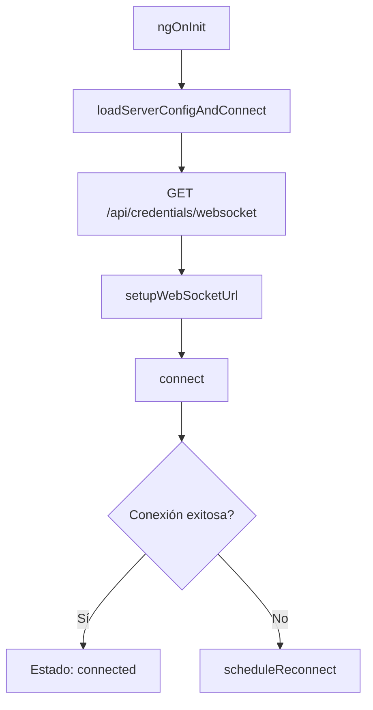

# Demo WebSocket Page - Ezekl Budget

## 📋 Descripción

Página de demostración y testing para conexiones WebSocket en tiempo real. Permite verificar el funcionamiento, latencia y estabilidad de la comunicación bidireccional entre el cliente y el servidor.

## 🎯 Características Principales

### 1. **Monitoreo de Conexión en Tiempo Real**
- Estado visual de la conexión (Conectado/Conectando/Desconectado)
- Indicadores de color según estado
- Información detallada de la conexión:
  - URL del WebSocket
  - Intentos de reconexión
  - Timestamp del último ping/pong
  - Latencia de comunicación

### 2. **Sistema de Reconexión Automática**
- Reconexión automática con backoff exponencial
- Máximo 5 intentos de reconexión
- Incremento progresivo del intervalo de reconexión
- Reconexión manual disponible

### 3. **Historial de Mensajes**
- Visualización de últimos 10 mensajes
- Diferentes tipos de mensajes con colores distintivos:
  - **Welcome** (Azul): Mensaje de bienvenida del servidor
  - **Ping** (Verde): Mensajes ping enviados
  - **Pong** (Verde): Respuestas pong recibidas con latencia
  - **Echo** (Amarillo): Mensajes echo de prueba
  - **Error** (Rojo): Errores de conexión o comunicación

### 4. **Controles Interactivos**
- **Enviar Ping Manual**: Prueba de latencia
- **Enviar Echo Test**: Prueba de eco de mensajes
- **Reconectar WebSocket**: Forzar reconexión
- **Limpiar Mensajes**: Limpiar historial visual

## 🏗️ Arquitectura

### Componente Principal: `DemoWebsocketPage`

```typescript
export class DemoWebsocketPage implements OnInit, OnDestroy
```

#### Propiedades de Conexión
- **`ws`**: Instancia del WebSocket
- **`wsUrl`**: URL de conexión (configurada dinámicamente)
- **`connectionStatus`**: Estado actual ('connected' | 'connecting' | 'disconnected')
- **`reconnectAttempts`**: Contador de intentos de reconexión
- **`maxReconnectAttempts`**: Límite de intentos (5)

#### Propiedades de Ping/Pong
- **`pingInterval`**: Intervalo de ping automático
- **`pingIntervalTime`**: Tiempo entre pings (30s)
- **`lastPing`**: Timestamp del último ping enviado
- **`lastPong`**: Timestamp del último pong recibido

#### Gestión de Mensajes
- **`messages`**: Array de mensajes WebSocket
- **`maxMessages`**: Límite de mensajes visibles (10)

## 🔌 Configuración del WebSocket

### Detección Automática del Servidor

El componente detecta automáticamente la configuración del servidor mediante un endpoint REST:

```typescript
GET /api/credentials/websocket
```

**Respuesta esperada:**
```json
{
  "azure_openai_endpoint": "https://...",
  "azure_openai_deployment_name": "...",
  "message": "Credentials loaded successfully",
  "server_os": "Windows" | "Linux" | "Darwin"
}
```

### URL del WebSocket

La URL se construye dinámicamente según el entorno:

```typescript
// Protocolo según HTTPS/HTTP
const protocol = window.location.protocol === 'https:' ? 'wss:' : 'ws:';
let host = window.location.host;

// FIX para Windows: localhost -> 127.0.0.1
if (isServerWindows && host.startsWith('localhost')) {
  host = host.replace('localhost', '127.0.0.1');
}

// URL final
this.wsUrl = `${protocol}//${host}/ws/`;
```

### Fix Específico para Windows

**Problema**: En Windows, `localhost` puede resolverse a IPv6 (`::1`), causando problemas con WebSockets.

**Solución**: Cuando el servidor es Windows, se reemplaza automáticamente `localhost` por `127.0.0.1` (IPv4).

```typescript
// Ejemplo:
// ws://localhost:8001/ws/ → ws://127.0.0.1:8001/ws/
```

## 🔄 Ciclo de Vida del WebSocket

### 1. Inicialización


### 2. Conexión
```typescript
connect() {
  this.ws = new WebSocket(this.wsUrl);
  
  this.ws.onopen = () => {
    this.connectionStatus = 'connected';
    this.reconnectAttempts = 0;
  };
  
  this.ws.onmessage = (event) => {
    this.handleMessage(event.data);
  };
  
  this.ws.onclose = (event) => {
    this.connectionStatus = 'disconnected';
    if (event.code !== 1000) {
      this.scheduleReconnect();
    }
  };
}
```

### 3. Reconexión Automática (Backoff Exponencial)
```typescript
scheduleReconnect() {
  this.reconnectAttempts++;
  
  // Tiempo de espera = intervalo base * número de intentos
  const delay = this.reconnectInterval * this.reconnectAttempts;
  // Ejemplo: 3s, 6s, 9s, 12s, 15s
  
  setTimeout(() => {
    if (this.connectionStatus === 'disconnected') {
      this.connect();
    }
  }, delay);
}
```

### 4. Desconexión
```typescript
disconnect() {
  if (this.ws) {
    this.ws.close(1000, 'Cliente desconectándose');
    this.ws = null;
  }
  this.connectionStatus = 'disconnected';
}
```

## 📨 Protocolo de Mensajes

### Mensajes del Cliente

#### User Info (Nuevo)
```json
{
  "type": "user_info",
  "user_name": "Nombre del Usuario",
  "timestamp": "2025-10-07T10:30:00.000Z"
}
```
**Propósito**: Enviar información del usuario al servidor al conectar.

#### Ping
```json
{
  "type": "ping",
  "timestamp": "2025-10-07T10:30:00.000Z",
  "message": "ping from client",
  "user_name": "Nombre del Usuario"
}
```

#### Echo
```json
{
  "type": "echo",
  "message": "Test echo desde cliente - 10:30:00",
  "timestamp": "2025-10-07T10:30:00.000Z",
  "user_name": "Nombre del Usuario"
}
```

#### Greeting (Nuevo)
```json
{
  "type": "greeting",
  "message": "Hola, soy Nombre del Usuario",
  "timestamp": "2025-10-07T10:30:00.000Z",
  "user_name": "Nombre del Usuario"
}
```
**Propósito**: Enviar un saludo personalizado al servidor.

### Mensajes del Servidor

#### User Info Confirmed (Nuevo)
```json
{
  "type": "user_info_confirmed",
  "message": "¡Hola Nombre del Usuario! Tu información ha sido registrada.",
  "timestamp": "2025-10-07T10:30:00.000Z"
}
```

#### Welcome
```json
{
  "type": "welcome",
  "message": "Connected to Ezekl Budget WebSocket",
  "timestamp": "2025-10-07T10:30:00.000Z"
}
```

#### Pong
```json
{
  "type": "pong",
  "message": "pong",
  "client_timestamp": "2025-10-07T10:30:00.000Z",
  "server_timestamp": "2025-10-07T10:30:00.050Z"
}
```

#### Echo Response
```json
{
  "type": "echo",
  "echo": "Test echo desde cliente - 10:30:00",
  "timestamp": "2025-10-07T10:30:00.000Z"
}
```

#### Error
```json
{
  "type": "error",
  "message": "Invalid message format",
  "timestamp": "2025-10-07T10:30:00.000Z"
}
```

## 🎨 Estados Visuales

### Estado de Conexión

| Estado | Color | Icono | Descripción |
|--------|-------|-------|-------------|
| Connected | Verde (success) | `wifi` | WebSocket conectado y funcional |
| Connecting | Amarillo (warning) | `refresh` | Intentando establecer conexión |
| Disconnected | Rojo (danger) | `cloud-offline` | Sin conexión activa |

### Tipos de Mensajes

```scss
.message-ping {
  border-left-color: var(--ion-color-success);
  background: var(--ion-color-success-tint);
}

.message-welcome {
  border-left-color: var(--ion-color-primary);
  background: var(--ion-color-primary-tint);
}

.message-error {
  border-left-color: var(--ion-color-danger);
  background: var(--ion-color-danger-tint);
}

.message-echo {
  border-left-color: var(--ion-color-warning);
  background: var(--ion-color-warning-tint);
}
```

## 🔧 Métodos Principales

### Inicialización y Configuración

#### `ngOnInit()`
- Punto de entrada del componente
- Llama a `loadServerConfigAndConnect()`

#### `loadServerConfigAndConnect()`
```typescript
async loadServerConfigAndConnect(): Promise<void>
```
- Obtiene configuración del servidor via HTTP
- Detecta el SO del servidor
- Configura URL del WebSocket
- Inicia conexión

#### `setupWebSocketUrl(serverOS?: string)`
```typescript
private setupWebSocketUrl(serverOS?: string): void
```
- Construye URL del WebSocket dinámicamente
- Aplica fix de Windows si es necesario
- Registra configuración en consola

### Gestión de Conexión

#### `connect()`
```typescript
private connect(): void
```
- Crea instancia de WebSocket
- Configura event handlers (onopen, onmessage, onclose, onerror)
- Actualiza estado de conexión

#### `disconnect()`
```typescript
private disconnect(): void
```
- Cierra WebSocket con código 1000
- Limpia recursos
- Actualiza estado

#### `reconnect()`
```typescript
reconnect(): void
```
- Desconecta conexión actual
- Resetea contador de intentos
- Inicia nueva conexión tras 1 segundo

#### `scheduleReconnect()`
```typescript
private scheduleReconnect(): void
```
- Implementa backoff exponencial
- Incrementa contador de intentos
- Programa próximo intento de conexión

### Gestión de Mensajes

#### `handleMessage(data: string)`
```typescript
private handleMessage(data: string): void
```
- Parsea JSON recibido
- Identifica tipo de mensaje
- Delega a handler específico
- Maneja errores de parseo

#### `addMessage(type: string, content: string)`
```typescript
private addMessage(type: string, content: string): void
```
- Crea objeto WebSocketMessage
- Agrega a inicio del array
- Mantiene límite de 10 mensajes
- Genera ID único

#### `calculateLatency(pongMessage: any)`
```typescript
private calculateLatency(pongMessage: any): number
```
- Calcula diferencia entre timestamps
- Retorna latencia en milisegundos
- Usado en mensajes pong

### Acciones del Usuario

#### `sendPing()`
```typescript
sendPing(): void
```
- Envía mensaje ping al servidor
- Actualiza `lastPing`
- Registra en historial de mensajes

#### `sendEcho()`
```typescript
sendEcho(): void
```
- Envía mensaje echo con timestamp
- Registra en historial
- Servidor responde con mismo mensaje

#### `clearMessages()`
```typescript
clearMessages(): void
```
- Limpia array de mensajes
- Resetea vista del historial

### Utilidades

#### `getStatusText()`
```typescript
getStatusText(): string
```
- Convierte enum a texto español
- 'connected' → 'Conectado'
- 'connecting' → 'Conectando...'
- 'disconnected' → 'Desconectado'

#### `formatTime(isoString: string)`
```typescript
formatTime(isoString: string): string
```
- Convierte ISO 8601 a hora local
- Formato: HH:MM:SS
- Maneja strings vacíos

#### `trackByMessage(index: number, message: WebSocketMessage)`
```typescript
trackByMessage(index: number, message: WebSocketMessage): string
```
- TrackBy function para ngFor
- Optimiza renderizado de lista
- Usa ID único del mensaje

## 📁 Estructura de Archivos

```
demo-websocket/
├── demo-websocket.page.ts          # Lógica del componente
├── demo-websocket.page.html        # Template con UI
├── demo-websocket.page.scss        # Estilos de mensajes
├── demo-websocket.page.spec.ts     # Tests unitarios
└── README.md                        # Esta documentación
```

## 🎮 Casos de Uso

### Uso 1: Verificar Conectividad
1. Abrir página Demo WebSocket
2. Observar chip de estado
3. Verificar que muestre "Conectado" (verde)
4. Revisar URL de conexión

### Uso 2: Test de Latencia
1. Presionar botón "Enviar Ping Manual"
2. Observar timestamp en "Último ping"
3. Esperar respuesta pong
4. Verificar latencia calculada en el mensaje

### Uso 3: Test de Echo
1. Presionar botón "Enviar Echo Test"
2. Observar mensaje enviado en historial
3. Verificar respuesta del servidor
4. Confirmar que el mensaje se devuelve correctamente

### Uso 4: Test de Reconexión
1. Detener servidor backend
2. Observar que el estado cambia a "Desconectado"
3. Reiniciar servidor
4. Verificar reconexión automática

### Uso 5: Reconexión Manual
1. Presionar botón "Reconectar WebSocket"
2. Observar transición de estados
3. Verificar nueva conexión establecida

## 🧪 Testing

### Tests Manuales
- [ ] Conexión inicial exitosa
- [ ] Mensaje de bienvenida recibido
- [ ] Envío de ping funcional
- [ ] Cálculo correcto de latencia
- [ ] Envío de echo funcional
- [ ] Reconexión automática tras desconexión
- [ ] Reconexión manual funcional
- [ ] Backoff exponencial implementado
- [ ] Límite de 10 mensajes respetado
- [ ] Limpieza de mensajes funcional
- [ ] Fix de Windows aplicado correctamente

### Tests Unitarios (Pendientes)
```typescript
describe('DemoWebsocketPage', () => {
  it('should connect on init');
  it('should handle welcome message');
  it('should send ping correctly');
  it('should calculate latency');
  it('should reconnect automatically');
  it('should limit messages to 10');
  it('should format time correctly');
  it('should apply Windows fix when needed');
});
```

## 🐛 Troubleshooting

### Problema: No se conecta en Windows
**Causa**: localhost resuelve a IPv6 (::1)  
**Solución**: El fix automático debería resolverlo. Verificar en consola:
```
🔧 [Windows Server] WebSocket usando 127.0.0.1 en lugar de localhost
```

### Problema: Reconexión infinita
**Causa**: Servidor backend no disponible  
**Solución**: 
- Verificar que el servidor esté corriendo
- Revisar URL del WebSocket en la UI
- Máximo 5 intentos, luego se detiene

### Problema: Mensajes no aparecen
**Causa**: Error de parseo JSON  
**Solución**: 
- Revisar consola del navegador
- Verificar formato de mensajes del servidor
- Mensajes de error aparecen en historial

### Problema: Alta latencia en pings
**Causa**: Red lenta o servidor sobrecargado  
**Solución**: 
- Verificar conexión de red
- Revisar carga del servidor
- Latencia normal: < 100ms (LAN), < 500ms (WAN)

## 📊 Métricas de Rendimiento

### Latencia Esperada
- **LAN**: < 10ms
- **Localhost**: < 5ms
- **Internet**: < 200ms

### Tamaño de Mensajes
- **Ping**: ~100 bytes
- **Pong**: ~150 bytes
- **Echo**: ~150-300 bytes
- **Welcome**: ~150 bytes

### Intervalos
- **Ping automático**: 30 segundos (desactivado por defecto)
- **Reconexión base**: 3 segundos
- **Reconexión máxima**: 15 segundos (5to intento)

## 🔒 Seguridad

### Autenticación
- WebSocket hereda autenticación HTTP del servidor
- Token JWT validado en handshake inicial
- Sin autenticación adicional requerida en mensajes

### Validaciones
- Parseo seguro de JSON
- Validación de tipos de mensaje
- Manejo de errores en todos los handlers

## 🌐 Compatibilidad

### Navegadores Soportados
- ✅ Chrome/Edge (Chromium) 90+
- ✅ Firefox 88+
- ✅ Safari 14+
- ✅ Opera 76+

### Plataformas
- ✅ Web (Desktop/Mobile)
- ✅ iOS (Capacitor)
- ✅ Android (Capacitor)

### Protocolos
- ✅ WebSocket (RFC 6455)
- ✅ WS (inseguro)
- ✅ WSS (seguro con TLS)

## 🚀 Mejoras Futuras

- [ ] Implementar ping automático configurable
- [ ] Gráfico de latencia en tiempo real
- [ ] Exportar historial de mensajes
- [ ] Filtros por tipo de mensaje
- [ ] Estadísticas de conexión (uptime, mensajes/s)
- [ ] Notificaciones push cuando se reconecta
- [ ] Soporte para múltiples canales/rooms
- [ ] Compresión de mensajes (permessage-deflate)
- [ ] Heartbeat visual animado
- [ ] Tests E2E automatizados

## 📞 Contacto y Soporte

Para reportar bugs o solicitar features:
- Crear issue en el repositorio
- Contactar al equipo de desarrollo

---

**Versión**: 1.0.0  
**Última actualización**: Octubre 2025  
**Mantenedor**: Equipo Ezekl Budget
