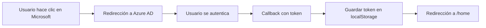
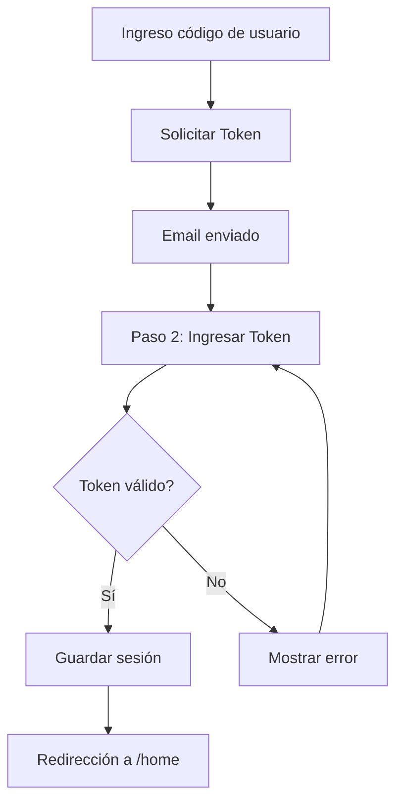

# Login Page - Ezekl Budget

## 📋 Descripción

Página de autenticación con sistema de verificación en dos pasos (2FA) que soporta:
- **Autenticación con Microsoft** (SSO empresarial)
- **Autenticación manual** con código de usuario y token por email

## 🎯 Características Principales

### 1. **Autenticación Dual**
- **Microsoft SSO**: Integración con Azure AD para acceso empresarial
- **Verificación Manual**: Sistema tradicional con token de 5 dígitos enviado por email

### 2. **Wizard de 2 Pasos**
El proceso de login manual sigue un flujo guiado:

#### Paso 1: Solicitud de Token (`REQUEST_TOKEN`)
- Usuario ingresa su código de usuario
- Sistema valida el código y envía token por email
- Transición automática al paso 2

#### Paso 2: Verificación de Token (`ENTER_TOKEN`)
- Usuario ingresa código de 5 dígitos recibido por email
- Validación de token y autenticación
- Redirección automática a `/home` tras éxito

### 3. **Experiencia de Usuario Mejorada**

#### 📧 Inputs Inteligentes de Token
- **5 inputs individuales** para cada dígito del token
- **Auto-focus** al siguiente input al escribir
- **Backspace inteligente** que retrocede al input anterior
- **Auto-submit** cuando se completan los 5 dígitos
- **Validación numérica** en tiempo real

#### 📋 Portapapeles Automático
- Botón para pegar token desde el portapapeles
- Detección automática de formato de 5 dígitos
- Auto-submit tras pegado exitoso

#### 🎨 Modo Oscuro
- Soporte completo para modo claro/oscuro de Ionic
- Variables CSS dinámicas que respetan el tema activo
- Contraste óptimo en ambos modos

#### ♿ Accesibilidad
- Labels y placeholders descriptivos
- Validación de formularios en tiempo real
- Mensajes de error claros y contextuales
- Manejo de focus para evitar conflictos con `aria-hidden`

## 🏗️ Arquitectura

### Componente Principal: `LoginPage`

```typescript
export class LoginPage implements OnInit, OnDestroy, ViewWillLeave, ViewDidLeave
```

#### Formularios Reactivos
- **`step1Form`**: Formulario para código de usuario
- **`step2Form`**: Formulario para los 5 dígitos del token
- **`tokenControls`**: Array de 5 FormControls individuales

#### Observables
- **`wizardState$`**: Estado global del wizard (paso actual, loading, errores)
- **`authState`**: Estado de autenticación del usuario

#### Lifecycle Hooks
- **`ngOnInit()`**: Inicialización, verificación de autenticación previa, detección de callback de Microsoft
- **`ngOnDestroy()`**: Limpieza de suscripciones
- **`ionViewWillLeave()`**: Quita focus antes de salir para evitar conflictos
- **`ionViewDidLeave()`**: Limpieza adicional

## 🔐 Flujo de Autenticación

### Flujo con Microsoft


### Flujo Manual


## 📁 Estructura de Archivos

```
login/
├── login.page.ts          # Lógica del componente
├── login.page.html        # Template con wizard
├── login.page.scss        # Estilos con soporte dark mode
├── login.page.spec.ts     # Tests unitarios
└── README.md              # Esta documentación
```

## 🎨 Estilos y Temas

### Variables CSS Principales
```scss
.token-digit-input {
  --color: var(--ion-text-color);              // Texto adaptativo
  --background: var(--ion-background-color);   // Fondo adaptativo
  --border-color: var(--ion-color-medium);     // Borde
  --placeholder-color: var(--ion-color-medium-tint);
}
```

### Estados Visuales
- **Normal**: Color de texto y fondo según tema
- **Enfocado**: Borde color primario, grosor 2px
- **Válido**: Borde y texto verde (success)
- **Error**: Mensaje en rojo (danger)

## 🔧 Métodos Principales

### Autenticación con Microsoft
```typescript
loginWithMicrosoft()
```
- Construye URL de autenticación según entorno (dev/prod)
- Redirige a Azure AD
- Maneja callback automático

### Callback de Microsoft
```typescript
private checkForMicrosoftCallback()
```
- Detecta parámetros `token` y `expires` en URL
- Guarda credenciales en localStorage
- Limpia URL y recarga la página

### Solicitud de Token
```typescript
async requestToken()
```
- Valida código de usuario
- Llama al servicio de autenticación
- Muestra toast de éxito/error
- Transición automática al paso 2

### Login con Token
```typescript
async login()
```
- Combina los 5 dígitos individuales
- Valida token con el backend
- Guarda sesión y redirige a `/home`

### Gestión de Inputs del Token
```typescript
onDigitInput(index: number, event: any, inputElement: any)
onDigitKeydown(index: number, event: KeyboardEvent)
onDigitFocus(index: number)
```
- **`onDigitInput`**: Maneja entrada de cada dígito, auto-focus al siguiente
- **`onDigitKeydown`**: Maneja Backspace y teclas especiales
- **`onDigitFocus`**: Asegura orden correcto de entrada

### Portapapeles
```typescript
async tryAutoCopy()
```
- Lee contenido del portapapeles
- Valida formato (5 dígitos)
- Llena inputs automáticamente
- Auto-submit si es válido

### Utilidades
```typescript
goBack()              // Volver al paso anterior
resendToken()         // Reenviar token por email
clearTokenInputs()    // Limpiar todos los inputs del token
```

## 🚀 Uso

### Template HTML

#### Paso 1: Código de Usuario
```html
<ion-input formControlName="codeLogin" 
           placeholder="Ej: ABC123" 
           maxlength="10" 
           [clearInput]="true">
</ion-input>
```

#### Paso 2: Token de 5 Dígitos
```html
<ion-input #tokenInput
           [formControlName]="'digit' + (i + 1)"
           fill="outline"
           type="tel"
           inputmode="numeric"
           maxlength="1"
           class="token-digit-input"
           (ionInput)="onDigitInput(i, $event, tokenInput)">
</ion-input>
```

## 🧪 Testing

### Casos de Prueba Principales
- [ ] Validación de formularios
- [ ] Flujo completo de autenticación manual
- [ ] Flujo completo de autenticación con Microsoft
- [ ] Manejo de errores
- [ ] Auto-focus entre inputs
- [ ] Backspace y navegación con teclado
- [ ] Pegado desde portapapeles
- [ ] Adaptación a modo oscuro
- [ ] Responsividad en diferentes dispositivos

## 📱 Responsividad

### Breakpoints
- **Mobile**: `size="2"` - 2 columnas por input
- **Tablet**: `size-md="1.5"` - Inputs más pequeños
- **Desktop**: `size-lg="4"` - Card centrada con ancho fijo

### Ajustes de Altura
```scss
height: 60px;              // Desktop/Tablet

@media (max-width: 480px) {
  height: 50px;            // Mobile
  font-size: 1.3rem;       // Fuente más pequeña
}
```

## 🔒 Seguridad

### Tokens
- Token de 5 dígitos numéricos
- Enviado por email
- Validación en backend
- Expiración automática

### Microsoft SSO
- Autenticación delegada a Azure AD
- Token JWT desde backend
- Almacenamiento seguro en localStorage

### Validaciones
- Código de usuario: 1-10 caracteres
- Token: Exactamente 5 dígitos numéricos
- Timeout en solicitudes
- Limpieza de inputs tras errores

## 🌐 URLs de Entorno

### Desarrollo
- Backend: `http://localhost:8001`
- Microsoft Auth: `http://localhost:8001/api/auth/microsoft/login`

### Producción
- Backend: `https://budget.ezekl.com`
- Microsoft Auth: `https://budget.ezekl.com/api/auth/microsoft/login`

## 📊 Estado del Wizard

### Interface: `LoginWizardState`
```typescript
{
  currentStep: LoginStep;           // REQUEST_TOKEN | ENTER_TOKEN
  isLoading: boolean;               // Estado de carga
  error: string | null;             // Mensaje de error
  user?: {                          // Datos del usuario (paso 2)
    nameLogin: string;
    emailLogin: string;
  };
}
```

## 🎯 Mejoras Futuras
- [ ] Soporte para biometría (Face ID / Touch ID)
- [ ] Recordar dispositivo de confianza
- [ ] Añadir más proveedores SSO (Google, GitHub)
- [ ] Implementar rate limiting visual
- [ ] Añadir animaciones de transición entre pasos
- [ ] Soporte para autenticación con QR
- [ ] Modo offline con caché de credenciales

## 📞 Contacto y Soporte

Para reportar bugs o solicitar features:
- Crear issue en el repositorio
- Contactar al equipo de desarrollo

---

**Versión**: 1.0.0  
**Última actualización**: Octubre 2025  
**Mantenedor**: Equipo Ezekl Budget
